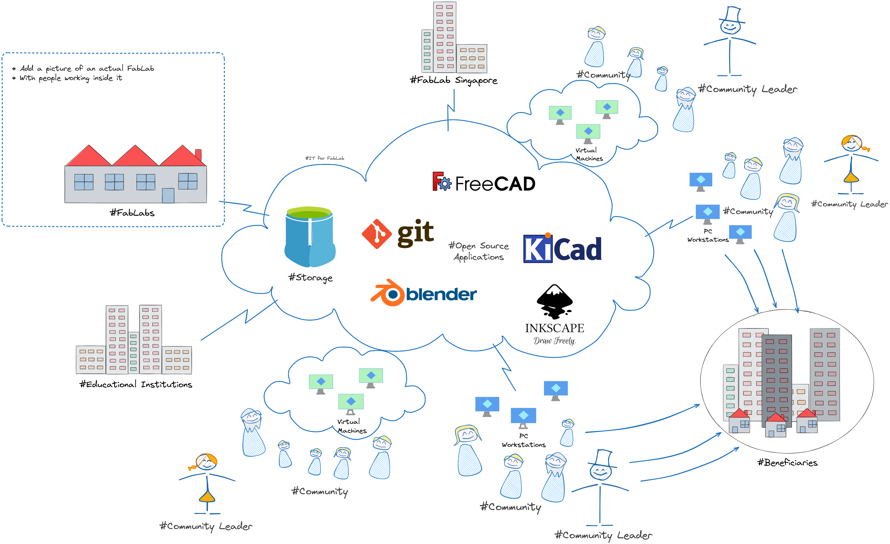

# FabLab Singapore Project Documentation

## Mission

Develop and sustain a healty community of 'makers' in Singapore by promoting the FabLab Movement's values:

- 'Maker' mindset
- Sharing and collaboration
- Sustainability and inclusiveness
- Social responsibility

## The Eco-System

The ultimate objective of this project is to nurture an eco-system which enables the accomplishment of the Mission.

Such eco-system is made of several components:

* **FabLabs** ([https://fablabs.io](https://fablabs.io)) - digital manufacturing laboratories capable of providing everything that is needed to allow anyone to make (almost) anything:
  
  * Knowledge and skills
  
  * Certification of compentence
  
  * Access to digital manufacturing equipment
  
  * Manufacturing materials

* **Makers community leaders** - individuals who build makers communities around a wide variety of themes or issues. These individuals:
  
  * Have strong networks of followers and stakeholders actively enganged around their respective themes.
  
  * Have been running existing programmes for quite some time, which are compatible with the FabLab Movement's values and could be boosted by having access to making capabilities and a much larger community.

* **Makers community** - individuals from all walks of life who have interest in 'making things', being them already affiliated or not to any of the existing communities, and having them or not being formally educated in engineering or allied disciplines.

* **Engineering students** - these individuals are actually a subset of 'the makers community', with the special spin that they are still undergoing 'making' education, thus having access to making resources, but also the need for ideas and challenges of enough substance and value to become their final year projects or areas of reserach.

* **Engineering professors** - these individuals are actually a subset of 'the makers community', with the special spin that they work at engineering education institutions, thus having access not only to making resourses, but also to the engineering students and alumni, being them the perfect platform for mentoring and coaching the next generations of 'professional makers'.

* **FabLab Singapore** (aka 'the federation') - it is a non-profit institution created for the purpose of glueing together the whole eco-system, providing governance, administration, communication and support services. It owns the IT for FabLab.

* **IT for FabLab** - this is the IT infrastructure designed, build and maintained for the purpose of supporting the data workflows and records across the eco-system. This infrastructure is owned by FabLab Singapore.

* **Beneficiaries** - individuals, groups and organisations (mostly non-profit organisations and charitable institutions), who can provide cases and challenges of significant social value for the makers community to address and resolve.

## Project objectives

### Scope

* Engage with the multiple communities of makers in Singapore to affiliate them and their members into a new FabLab Singapore federation.

* Setup and operate the necessary entities and structures for the FabLab Singapore federation to be governed and operated.

* Setup the legal framework required for the FabLabs (ie. SP FabLab) to be able to take workflows from the community and provide training, certification and other services  to them, while being FabLab Singapore the grantor and single point of accountability on behalf of the community members.

* Setup and operate the IT infrastructure required for the FabLabs (ie. SP FabLab) to be able to take workflows from the community and provide training, certification and other services to them.

* Develop and implement the marketing and communications strategies and plans required to develop, build, grow and sustain the FabLab Singapore.

* Develop and implement the FabLab Singapore's Social Responsability Charter.

### Deliverables

* An active federation of makers communities.

* An entity and structure capable of promoting and administering the makers community.

* An IT infrastructure capable of housing the makers community workflows and records, and their integration with the FabLabs workflows.

* The FabLab Singapore's Social Responsibility Charter.

## Project roles and responsibilities

> Describe the roles and reponsibilities of the people involved in the project.

## Resources, financial and quality plan

> Describe the resources needed and how they are going to be obtained, provided or paid for.
> 
> This means man-hours of effort, infrastructure, etc. and their cost.

## Work breakdown structure and schedule

> Describe the project timeline and its main milestones.
> 
> As this is the overall umbrella for the entire project, it should describe the high level timeline of the project phases and key milestones.
> 
> Each project phase will have its own ToR in a separate file.

### Project phases

- [Conceptualisation](ConceptualisationToR.md)

- [Pilot Design and Development](PilotDesignDevelopment.md)

- [Pilot Execution](PilotExecution.md)

- [Final Design and Development](FinalDesignDevelopment.md)

- [Implementation and Stabilisation](Implementation.md)

- [Post-Implementation Review](PIR.md)

## Key issues and risks

> Describe the main issues and risks of the project, ranking them on High, Medium or Low, and indicating their mitigation measures if available.
> 
> This should be for the issues and risks identified at the time of the issuance of the ToR, because in reality we will track the issues and risks on the tracker.

## Assumptions and constrains

> List of any significant assumptions we have made at the time of preparing the ToR.
