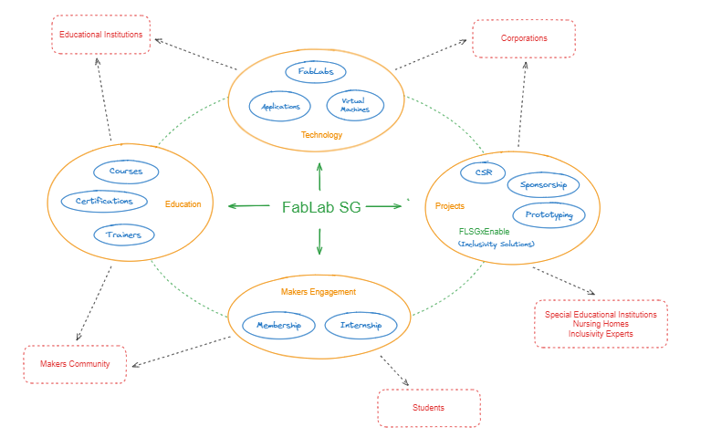

# FabLab Singapore Project Documentation

## Mission

Develop and sustain a healthy community of 'makers' in Singapore by promoting the FabLab Movement's values:

- 'Maker' mindset
- Sharing and collaboration
- Sustainability and inclusiveness
- Social responsibility

## The Eco-System

The ultimate objective of this project is to nurture an eco-system that enables the accomplishment of the Mission.

Such an eco-system is made of several components:

* **FabLabs** ([https://fablabs.io](https://fablabs.io)) - digital manufacturing laboratories capable of providing everything that is needed to allow anyone to make (almost) anything:
  
  * Knowledge and skills
  
  * Certification of compentence
  
  * Access to digital manufacturing equipment
  
  * Manufacturing materials

* **Makers community leaders** - individuals who build makers communities around a wide variety of themes or issues. These individuals:
  
  * Have strong networks of followers and stakeholders actively engaged around their respective themes.
  
  * Have been running existing programs for quite some time, which are compatible with the FabLab Movement's values and could be boosted by having access to making capabilities and a much larger community.

* **Makers community** - individuals from all walks of life who have an interest in 'making things', being them already affiliated or not to any of the existing communities, and having them or not being formally educated in engineering or allied disciplines.

* **Engineering students** - these individuals are actually a subset of 'the Makers Community', with the special spin that they are still undergoing 'making' education, thus having access to making resources, but also the need for ideas and challenges of enough substance and value to become their final year projects or areas of research.

* **Engineering professors** - these individuals are actually a subset of 'the Makers Community', with the special spin that they work at engineering education institutions, thus having access not only to making resources but also to the engineering students and alumni, being them the perfect platform for mentoring and coaching the next generations of 'professional makers'.

* **FabLab Singapore** (aka 'the federation') - it is a non-profit institution created to glue together the whole ecosystem, providing governance, administration, communication, and support services. It owns the IT for FabLab.

* **IT for FabLab** - This is the IT infrastructure designed, built, and maintained to support the data workflows and records across the eco-system. This infrastructure is owned by FabLab Singapore.

* **Beneficiaries** - individuals, groups, and organizations (mostly non-profit organizations and charitable institutions), who can provide cases and challenges of significant social value for the Makers Community to address and resolve.

## Project objectives

### Scope

* Engage with the multiple communities of makers in Singapore to affiliate them and their members into a new FabLab Singapore federation.

* Set up and operate the necessary entities and structures for the FabLab Singapore federation to be governed and operated.

* Setup the legal framework required for the FabLabs (ie. SP FabLab) to be able to take workflows from the community and provide training, certification and other services  to them, while being FabLab Singapore the grantor and single point of accountability on behalf of the community members.

* Setup and operate the IT infrastructure required for the FabLabs (ie. SP FabLab) to be able to take workflows from the community and provide training, certification and other services to them.

* Develop and implement the marketing and communications strategies and plans required to develop, build, grow, and sustain the FabLab Singapore.

* Develop and implement the FabLab Singapore's Social Responsibility Charter.

### Deliverables

* An active federation of makers communities.

* An entity and structure capable of promoting and administering the Makers community.

* An IT infrastructure capable of housing the Makers community workflows and records, and their integration with the FabLabs workflows.

* The FabLab Singapore's Social Responsibility Charter.

## Project roles and responsibilities

> Description of the main roles and responsibilities of the people involved in the project.

* Project Manager: (Vacant) Accountable for the management of the development and execution of the project.

* Project Customer: FabLab Singapore Management Board Responsible for the approval of the ToR, the acceptance of the deliverables, the approval of the Stage Gates and the provision of the resources required for the development and execution of the project.

* Beneficiary Liaison: Zann H, others Establishes and maintains communication with our beneficiaries for mutual understanding and cooperation for the Pilot Challenge.

* Makers Community Liaison: (Vacant) Establishes and maintains communication with the Makers Community for mutual understanding and cooperation for the Pilot Challenge.

* Challenge Producer: (Vacant) Runs various Challenges with the Makers Community for the beneficiaries. Planning and keeping track of timelines, resources, and deliverables.

## Resources, financial and quality plan

At the project inception, it is still unclear the amount of resources that will be required to complete the project, however, it is expected to be in the ballpark of 6,000 hours of effort, SGD 20,000 for the cost of infrastructure, and SGD 20,000 for marketing and communication expenses.

In order to provide transparency for the leadership, the team, and the community, the project will be developed in 6 phases, each of them with its own Terms of Reference, budget, and schedule, which should be approved by the leadership of the project on each successive Stage-Gate in order to move into the next phase.

## Work breakdown structure and schedule

The project will be developed in 6 phases, each of them marked by a Go/No-Go Stage Gate Review milestone:

* Project Start - 13/8/2024

* Stage Gate 1 - 11/9/2024

* Stage Gate 2 - 6/11/2024

* Stage Gate 3 - 29/1/2025

* Stage Gate 4 - 23/4/2025

* Stage Gate 5 - 8/10/2025

* Project Close - 5/11/2025

### Project phases

- [Conceptualisation](ConceptualisationToR.md)

- [Pilot Design and Development](PilotDesignDevelopment.md)

- [Pilot Execution](PilotExecution.md)

- [Final Design and Development](FinalDesignDevelopment.md)

- [Implementation and Stabilisation](Implementation.md)

- [Post-Implementation Review](PIR.md)

## Key issues and risks

> List of the significant issues or risks identified at the time of the preparation of these ToR.

| Issue/Risk | Description                                                                                                             | Rating | Mitigation                                                                                                              |
|:----------:| ----------------------------------------------------------------------------------------------------------------------- |:------:| ----------------------------------------------------------------------------------------------------------------------- |
| Risk       | Spend a lot of effort and resources to find out that there is no interest in the community or the key parties involved. | High   | Early engagement of key stakeholders. Stagegated project development in phases.                                         |
| Risk       | Not being able to secure the required resources and funds.                                                              | High   | Keep the project as lean as possible. Early engagement of potential sponsors. Stagegated project development in phases. |

## Assumptions and constraints

> List of the significant assumptions that were made at the time of the preparation of these ToRs.

* There are currently communities of makers in Singapore, who would be eager to get access to making resources and collaborate with each other.

* There are FabLabs in Singapore, who would be keen to expand their reach to the community and the general public.

* There are groups or individuals in Singapore, who would be keen to deploy new FabLab resources.

* There are educational institutions in Singapore, that would be keen to develop and deliver digital fabrication training for the community and the general public.

* We should be able to dedicate between 1 to 2 FTE resources to the project.
